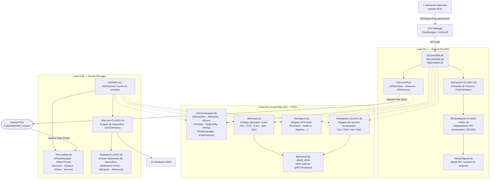
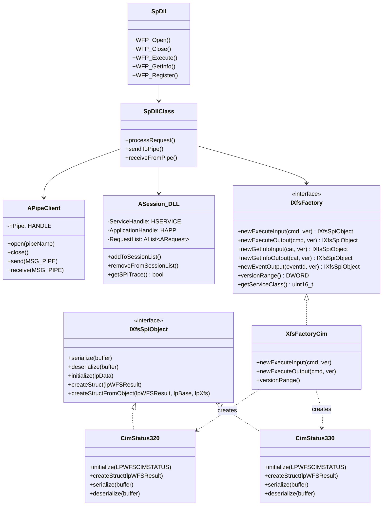
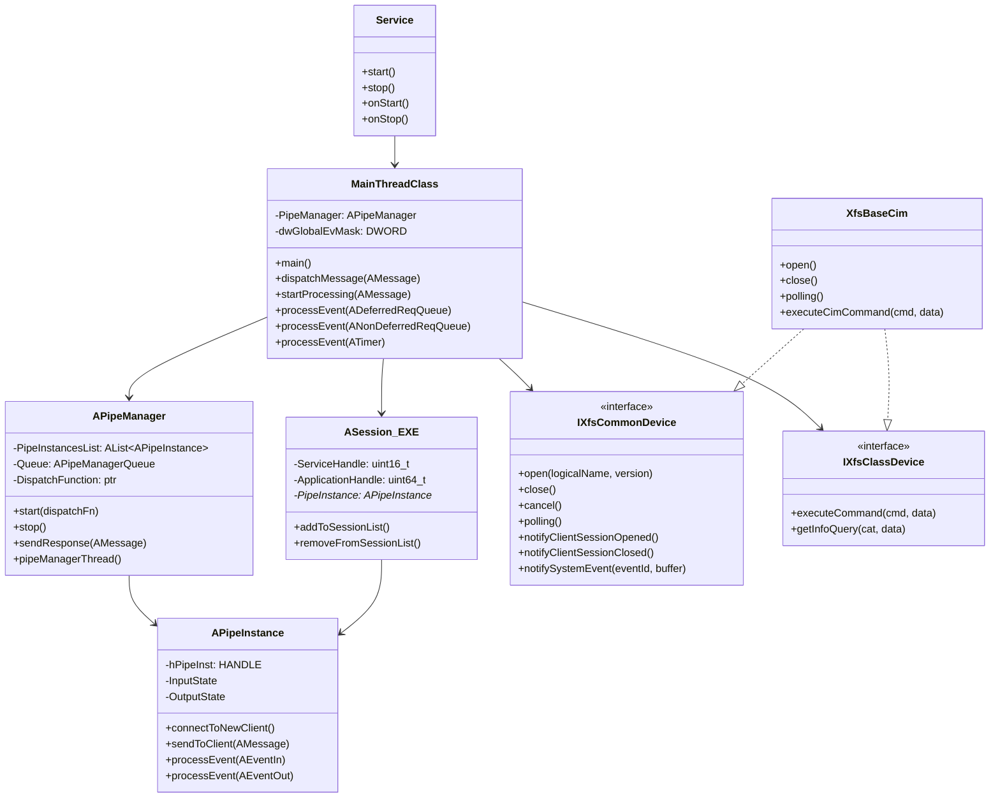
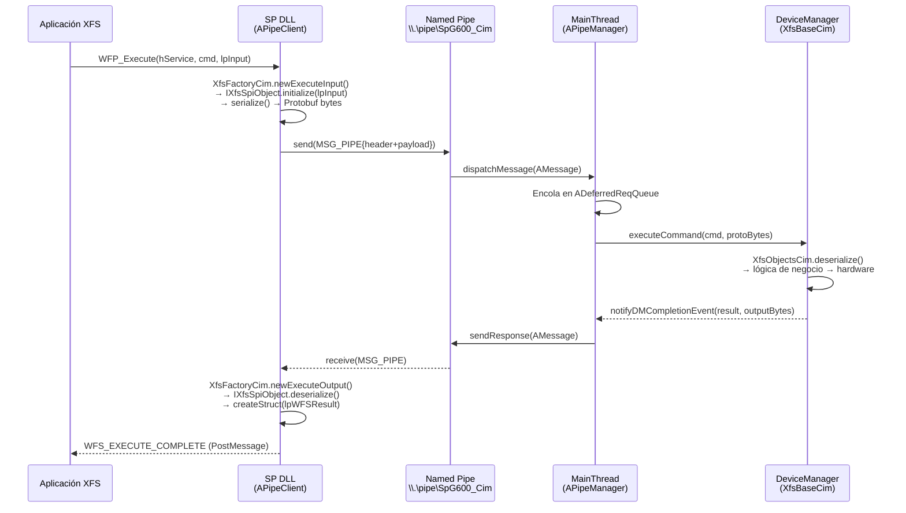
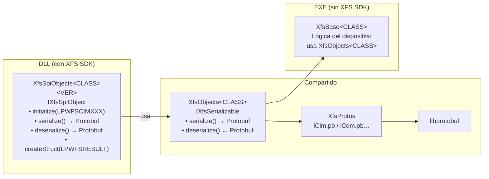
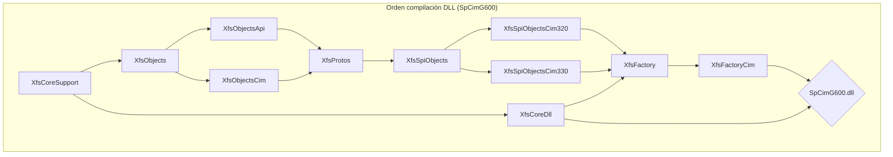

# SpG600 XfsCore — Arquitectura del Framework XFS

Framework de **Service Provider XFS (CEN/XFS)** para dispositivos bancarios (ATM) del modelo G600. Implementa la interfaz SPI de XFS separando la lógica en dos binarios que se comunican mediante Named Pipes: una **DLL** cargada por el XFS Manager y un **EXE** que gestiona el hardware físico.

---

## Índice

- [Visión general](#visión-general)
- [Diagrama de arquitectura global](#diagrama-de-arquitectura-global)
- [Parte DLL — Service Provider](#parte-dll--service-provider)
- [Parte EXE — Device Manager](#parte-exe--device-manager)
- [Librerías compartidas](#librerías-compartidas)
- [Comunicación DLL ↔ EXE](#comunicación-dll--exe)
- [Serialización: XfsObjects y XfsSpiObjects](#serialización-xfsobjects-y-xfsspiobjects)
- [Clases de dispositivo soportadas](#clases-de-dispositivo-soportadas)
- [Orden de compilación](#orden-de-compilación)
- [Ejemplos de flujo](#ejemplos-de-flujo)

---

## Visión general

```
 Aplicación bancaria (cliente XFS)
          │
          ▼
  XFS Manager / NeoManager  (msxfs.dll)
          │  WFSOpen / WFSExecute / WFSGetInfo ...
          ▼
 ┌─────────────────────────────┐
 │   SpCimG600.dll             │  ← Service Provider DLL (CIM)
 │   SpCdmG600.dll             │  ← Service Provider DLL (CDM)
 │   SpIpmG600.dll             │  ← Service Provider DLL (IPM)
 └───────────┬─────────────────┘
             │  Named Pipe (IPC)
             ▼
 ┌─────────────────────────────┐
 │        SpG600.exe           │  ← Device Manager EXE
 └─────────────────────────────┘
             │
             ▼
       Hardware físico (G600)
```

---

## Diagrama de arquitectura global



---

## Parte DLL — Service Provider

La DLL es la cara visible ante el **XFS Manager**. Implementa la interfaz SPI de XFS y delega el procesamiento real al EXE a través del pipe.

### Componentes

| Proyecto | Lib | Descripción |
|---|---|---|
| `SpG600/dllCim/SpCimG600` | DLL exportada | Entry point SPI para la clase CIM (aceptador de billetes) |
| `SpG600/dllCdm/SpCdmG600` | DLL exportada | Entry point SPI para la clase CDM (dispensador de efectivo) |
| `SpG600/dllIpm/SpIpmG600` | DLL exportada | Entry point SPI para la clase IPM (procesador de ítems) |
| `XfsCore/XfsCoreDll` | `XfsCoreDll.lib` | Núcleo DLL: `APipeClient`, `ASession`, `SpDll`, `SpDllClass`, `IXfsFactory`, `SpTrace` |
| `XfsFactorys/XfsFactory` | `XfsFactory.lib` | Factoría API/Common (versiones 320 y 330 incluidas) |
| `XfsFactorys/XfsFactoryCim` | `XfsFactoryCim.lib` | Factoría CIM — gateway + implementaciones `XfsFactoryCim320` / `XfsFactoryCim330` |
| `XfsFactorys/XfsFactoryCdm` | `XfsFactoryCdm.lib` | Factoría CDM — gateway + implementaciones `XfsFactoryCdm320` / `XfsFactoryCdm330` |
| `XfsFactorys/XfsFactoryIpm` | `XfsFactoryIpm.lib` | Factoría IPM — gateway + implementaciones `XfsFactoryIpm320` / `XfsFactoryIpm330` |
| `XfsSpiObjects/XfsSpiObjects` | `XfsSpiObjects.lib` | Objetos SPI base: eventos de sistema (DevStatus, HwError, AppDisc, VrsnError) |
| `XfsSpiObjects/XfsSpiObjectsCim320` | `XfsSpiObjectsCim320.lib` | Adaptadores SPI CIM para XFS 3.20 (wrappean `LPWFSCIMXXX`) |
| `XfsSpiObjects/XfsSpiObjectsCim330` | `XfsSpiObjectsCim330.lib` | Adaptadores SPI CIM para XFS 3.30 |
| `XfsSpiObjects/XfsSpiObjectsCdm320` | `XfsSpiObjectsCdm320.lib` | Adaptadores SPI CDM para XFS 3.20 |
| `XfsSpiObjects/XfsSpiObjectsCdm330` | `XfsSpiObjectsCdm330.lib` | Adaptadores SPI CDM para XFS 3.30 |
| `XfsSpiObjects/XfsSpiObjectsIpm320` | `XfsSpiObjectsIpm320.lib` | Adaptadores SPI IPM para XFS 3.20 |
| `XfsSpiObjects/XfsSpiObjectsIpm330` | `XfsSpiObjectsIpm330.lib` | Adaptadores SPI IPM para XFS 3.30 |

### Diagrama detallado DLL



---

## Parte EXE — Device Manager

El EXE es un **servicio de Windows** que gestiona el acceso al hardware. Recibe los mensajes del pipe, los encola y los despacha al `DeviceManager` correspondiente.

### Componentes

| Proyecto | Lib | Descripción |
|---|---|---|
| `SpG600/exe/SpG600` | `SpG600.exe` | Punto de entrada, arranque del servicio Windows, bucle principal |
| `XfsCore/XfsCoreExe` | `XfsCoreExe.lib` | Núcleo EXE: `APipeManager`, `AMainThread`, `ASession`, `AQueue`, `ATimer`, `AExternalEvent`, `Service`, `IXfsCommonDevice`, `IXfsClassDevice` |
| `XfsBase/XfsBaseDevice` | `XfsBaseDevice.lib` | Interfaz abstracta base de cualquier dispositivo |
| `XfsBase/XfsBaseApi` | `XfsBaseApi.lib` | Clase base para comandos API/Common |
| `XfsBase/XfsBaseCim` | `XfsBaseCim.lib` | Base CIM: `IXfsBaseCim`, `XfsBaseCim`, `XfsCacheCim`, `XfsEventsCim` |
| `XfsBase/XfsBaseCdm` | `XfsBaseCdm.lib` | Base CDM: `IXfsBaseCdm`, `XfsBaseCdm`, `XfsCacheCdm`, `XfsEventsCdm` |
| `XfsBase/XfsBaseIpm` | `XfsBaseIpm.lib` | Base IPM: `IXfsBaseIpm`, `XfsBaseIpm`, `XfsCacheIpm`, `XfsEventsIpm` |

### Parte específica `SpG600.h`:
	Clase `CSpCommonG600` contiene la lógica específica de los comandos comunes a cualquier dispositivo (extiende de XfsBaseDevice)
	Clase `CSpCimG600` contiene la lógica específica de los comandos relativos a las peticiones de ejecución del CIM (extiende de XfsBaseCim)
    Clase `CSpCdmG600` contiene la lógica específica de los comandos relativos a las peticiones de ejecución del CDM (extiende de XfsBaseCdm)
	Clase `CSpIpmG600` contiene la lógica específica de los comandos relativos a las peticiones de ejecución del IPM (extiende de XfsBaseIpm)
	
	**Todas estas clases delegan sus peticiones a instancia única de la clase RecyclerFacade y al intanciarlas la proveen de los interfaces para interarccionar con sus cachés, mandar eventos globales o cambiar tiempo Polling.**
	
### Parte específica `SpG600.cpp`: 
	Se produce inyección de instancias únicas de las clases `CSpCommonG600` (open,close,...) ,`CSpCimG600` & `CSpCdmG600` & `CSpIpmG600` (getInfo's y execute's de Cim, Cdm e Ipm, respectivamente)


Clase `CSpCommon<DEVICE>` (G600,..) contienen la lógica específica de cada dispositivo e implementan las interfaces `XfsBase<CLASS>`.
Los proyectos `CSpCommon<DEVICE>` (G600,..) contienen la lógica específica de cada dispositivo e implementan las interfaces `XfsBase<CLASS>`.


### Diagrama detallado EXE



---

## Librerías compartidas

Estas librerías son usadas tanto por la DLL como por el EXE.

### XfsCoreSupport

Utilidades básicas del framework. **No depende de XFS SDK** ni de ninguna capa superior.

| Clase / Fichero | Descripción |
|---|---|
| `AException` / `ARequest` | Excepción interna del pipe y encapsulación de petición XFS |
| `AEvent` / `AEventHandler` | Abstracción de eventos Win32 (OVERLAPPED/WaitForMultipleObjects) |
| `ACritSec` | Sección crítica RAII |
| `ALink` / `AList<T>` | Lista enlazada intrusiva genérica |
| `RegConfig` | Lectura de configuración desde el registro de Windows |
| `IXfsApi` | Interfaz base que define los tipos XFS agnósticos de versión |
| `IPipeProtocol` | Definición del protocolo `MSG_PIPE` (cabecera + payload) |
| `IXfsSerializable` | Interfaz de serialización/deserialización |

### XfsObjects y XfsObjects\<CLASS\>

Objetos de dominio **independientes del XFS SDK**, serializables vía Protobuf. Usados como representación interna en ambos lados del pipe.

| Proyecto | Lib | Descripción |
|---|---|---|
| `XfsObjects/XfsObjects` | `XfsObjects.lib` | Objetos XFS base: `DevStatus`, `HwError`, `AppDisc`, `VrsnError`, `ObjNumber`, `TXfs` |
| `XfsObjects/XfsObjectsApi` | `XfsObjectsApi.lib` | Objetos de dominio API: `ApiStatus`, `ApiCaps`, `ApiServiceInfo`… |
| `XfsObjects/XfsObjectsCim` | `XfsObjectsCim.lib` | Objetos de dominio CIM: `CimStatus`, `CimCaps`, `CimCashIn`, `CimNoteType`… |
| `XfsObjects/XfsObjectsCdm` | `XfsObjectsCdm.lib` | Objetos de dominio CDM: `CdmStatus`, `CdmCaps`, `CdmDispense`, `CdmDenomination`… |
| `XfsObjects/XfsObjectsIpm` | `XfsObjectsIpm.lib` | Objetos de dominio IPM: `IpmStatus`, `IpmCaps`, `IpmMediaIn`, `IpmImageData`… |

### XfsProtos

Código C++ generado automáticamente por `protoc` a partir de los ficheros `.proto`. Cada clase de dispositivo tiene su propio proto.

| Fichero generado | Contenido |
|---|---|
| `iXfs.pb.cc` / `.h` | Mensajes XFS comunes (DevStatus, HwError…) |
| `iApi.pb.cc` / `.h` | Mensajes API/Common |
| `iCim.pb.cc` / `.h` | Mensajes CIM |
| `iCdm.pb.cc` / `.h` | Mensajes CDM |
| `iIpm.pb.cc` / `.h` | Mensajes IPM |
| `iPin.pb.cc` / `.h` | Mensajes PIN |

---

## Comunicación DLL ↔ EXE

La DLL actúa como **cliente del pipe** y el EXE como **servidor**. El protocolo es asíncrono con `OVERLAPPED` I/O.



### Estructura MSG_PIPE

```cpp
// Protocolo de mensajes en el pipe (IPipeProtocol.h)
struct MSG_PIPE_HEADER {
    uint32_t magic;       // Identificador del protocolo
    uint32_t msgType;     // Tipo: REQUEST / RESPONSE / EVENT
    uint32_t payloadSize; // Tamaño del payload serializado
};

struct MSG_PIPE {
    MSG_PIPE_HEADER header;
    std::vector<uint8_t> payload; // Datos serializados con Protobuf
};
```

---

## Serialización: XfsObjects y XfsSpiObjects

El flujo de datos entre capas usa dos jerarquías de objetos diferenciadas:



| Librería | Lado | Propósito |
|---|---|---|
| `XfsSpiObjects.lib` | DLL | Eventos de sistema SPI: `XfsSpiDevStatus`, `XfsSpiHwError`, `XfsSpiAppDisc`… |
| `XfsSpiObjects<CLASS><VER>.lib` | DLL | Adaptan structs XFS SDK (`LPWFSCIMSTATUS`, etc.) a `IXfsSpiObject` serializable |
| `XfsObjects.lib` | DLL + EXE | Objetos de eventos XFS base (sin dependencia del SDK) |
| `XfsObjects<CLASS>.lib` | DLL + EXE | Objetos de dominio por clase (ej. `CimStatus`, `CdmDispense`); implementan `IXfsSerializable` |
| `XfsBase<CLASS>.lib` | EXE | Clases abstractas del dispositivo; contiene caché de estado (`XfsCache<CLASS>`) y definición de eventos (`XfsEvents<CLASS>`) |

---

## Clases de dispositivo soportadas

| Sigla | Nombre | DLL | Libs EXE añadidas |
|---|---|---|---|
| **CIM** | Cash In Module | `SpCimG600.dll` | `XfsBaseCim.lib` + `XfsObjectsCim.lib` |
| **CDM** | Cash Dispenser Module | `SpCdmG600.dll` | `XfsBaseCdm.lib` + `XfsObjectsCdm.lib` |
| **IPM** | Item Processing Module | `SpIpmG600.dll` | `XfsBaseIpm.lib` + `XfsObjectsIpm.lib` |

Versiones XFS soportadas por los `XfsSpiObjects<CLASS><VER>`: **320, 330** (extensible a 303, 310, 340).

---

## Orden de compilación

> Las dependencias deben compilarse en el orden indicado (cada lib depende de las anteriores).

### EXE — `SpG600.exe`

```
1. XfsCoreSupport.lib
2. XfsCoreExe.lib
3. XfsProtos.lib
4. XfsObjects.lib
5. XfsObjectsCim.lib  /  XfsObjectsCdm.lib  /  XfsObjectsIpm.lib
6. XfsBaseDevice.lib
7. XfsBaseCim.lib  /  XfsBaseCdm.lib  /  XfsBaseIpm.lib

── Externas ──
   libprotobuf.lib  (libprotobufd.lib en Debug)
   abseil_dll.lib
```

### DLL — `SpCimG600.dll` (ejemplo CIM)

```
1. XfsCoreSupport.lib
2. XfsCoreDll.lib
3. XfsObjects.lib
4. XfsObjectsCim.lib
5. XfsProtos.lib
6. XfsSpiObjects.lib
7. XfsSpiObjectsCim320.lib  /  XfsSpiObjectsCim330.lib
8. XfsFactory.lib            (factoría Common eventos SYSE)
9. XfsFactoryCim.lib         (factoría CIM con versiones 320+330)
── Externas ──
   msxfs.lib       (NeoManager — evita dependencia de xfs_conf.lib)
   libprotobuf.lib
   abseil_dll.lib
```



---

## Ejemplos de flujo

### Apertura de sesión (WFSOpen)

```
App → WFSOpen("CimG600", ...)
  → NeoManager carga SpCimG600.dll
  → WFP_Open(hService, hApp, "CimG600", ...)
    → ASession creada en DLL
    → APipeClient.open("\\.\pipe\SpG600_Cim")
    → MSG_PIPE {type=OPEN, hService, appName, version}  →→ Pipe →→
      → APipeManager.dispatchMessage()
        → MainThreadClass.startProcessing()
          → IXfsCommonDevice.open("CimG600", version)
            → notifyDMInitialized()
      ←← Pipe ←← MSG_PIPE {type=OPEN_RESPONSE, WFS_SUCCESS}
    → WFS_OPEN_COMPLETE (PostMessage al hWnd de la App)
```

### Ejecución de comando (WFSAsyncExecute)

```
App → WFSAsyncExecute(hService, WFS_CMD_CIM_CASH_IN_START, lpInput, ...)
  → WFP_Execute()
    → XfsFactoryCim.newExecuteInput(WFS_CMD_CIM_CASH_IN_START, version)
      → new CimCashInStart320 : IXfsSpiObject
        → initialize(lpInput)           ← toma la struct XFS SDK
        → serialize() → Protobuf bytes  ← vía XfsObjectsCim + XfsProtos
    → APipeClient.send(MSG_PIPE{EXECUTE, cmd, protoBytes})  →→ Pipe →→
      → APipeManager → MainThreadClass
        → Encola en ANonDeferredReqQueue
        → IXfsClassDevice.executeCommand(cmd, protoBytes)
          → XfsObjectsCim::CimCashInStart.deserialize(protoBytes)
          → XfsBaseCim → hardware físico inicia operación
          → notifyDMCompletionEvent(WFS_SUCCESS, outputBytes)
      ←← Pipe ←← MSG_PIPE{EXECUTE_COMPLETE, WFS_SUCCESS, protoOutput}
    → XfsFactoryCim.newExecuteOutput(WFS_CMD_CIM_CASH_IN_START, version)
      → IXfsSpiObject.deserialize(protoOutput)
      → createStruct(lpWFSResult) → LPWFSCIMCASHIN
    → WFS_EXECUTE_COMPLETE (PostMessage)
```

### Evento de dispositivo (SRVE)

```
Hardware → IRQ / polling en XfsBaseCim
  → IXfsCommonDevice.notifySystemEvent(WFS_SRVE_CIM_CASHUNITINFOCHANGED, buffer)
    → XfsObjectsCim::CimCashInfo.serialize() → protoBytes
    → notifyDMEvent(WFS_SRVE_CLASS, WFS_SRVE_CIM_CASHUNITINFOCHANGED, protoBytes)
      → MainThreadClass: AMonitor lookup → sesiones registradas
        → APipeManager.sendResponse(AMessage{EVENT, ...})  →→ Pipe →→
          → APipeClient.receive()
            → XfsFactoryCim.newEventOutput(eventId, version)
              → IXfsSpiObject.deserialize() → createStruct()
            → WFS_SERVICE_EVENT (PostMessage a HWNDs registradas)
```

---

## Dependencias externas

| Librería | Uso | Plataforma |
|---|---|---|
| `libprotobuf.lib` / `libprotobufd.lib` | Serialización Protobuf | x86 / x64 |
|  Otras dependencias de ProtoBuff (abseil.lib,...) | Dependencia interna de Protobuf | x86 / x64 |
| `msxfs.lib` (NeoManager) | Stub XFS Manager propio (sin `xfs_conf.lib`) | x86 / x64 |
| `BswLog.lib` | Sistema de trazas/logging | x86 / x64 |
| XFS SDK (`xfs320/`, `xfs330/`) | Cabeceras del estándar XFS (solo lado DLL) | — |

> **Nota:** Las versiones de `libprotobuf` y  otras dependencias de ProtoBuff deben coincidir con la plataforma de compilación (x86 vs x64) y configuración (release vs debug). 
> El XFS SDK (`xfs320`, `xfs330`) **solo es necesario en el lado DLL** a través de `XfsSpiObjects<CLASS><VER>`. El EXE trabaja exclusivamente con `XfsObjects<CLASS>` sin dependencia del SDK.