Línea temporal general  
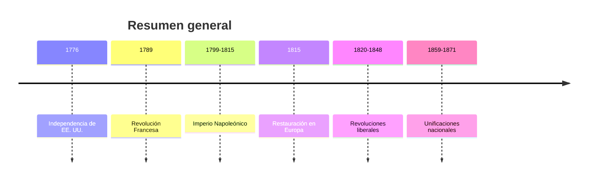

1️⃣ Fin del Antiguo Régimen  
  ```mermaid
graph TD
  A[Siglo XVIII<br/>Crisis del Antiguo Régimen] --> B[Crisis económica<br/>malas cosechas y hambre]
  B --> C[Desigualdad social<br/>privilegios de nobleza y clero]
  C --> D[Difusión de la Ilustración<br/>libertad, igualdad, soberanía nacional]
  D --> E[Cuestionamiento del absolutismo<br/>y del sistema estamental]
  E --> F[Preparan las revoluciones<br/>americana y francesa]
```

1️⃣ Fin del Antiguo Régimen – Línea temporal
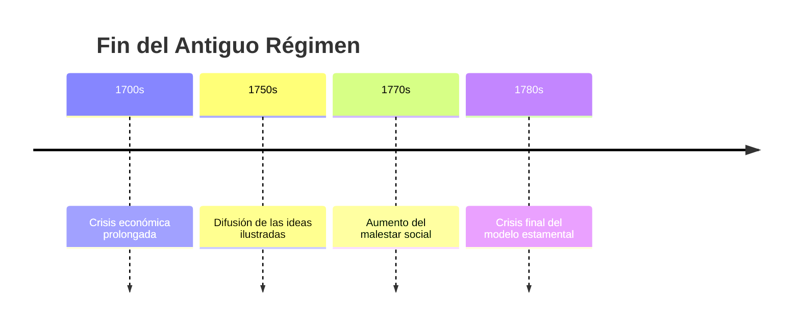

2️⃣ Revolución Americana
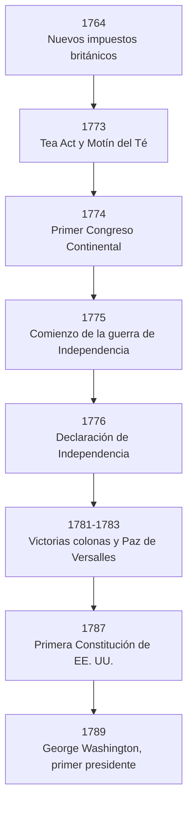

2️⃣ [Revolución Americana – Línea temporal](https://www.youtube.com/watch?v=F0C7Cju1NFc&list=PLmD-AwX9TN2_VVg6sXjF3_IoWvF_UKzUU&index=4)
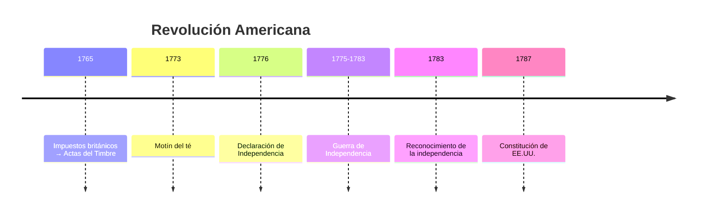
3️⃣ Revolución Francesa 
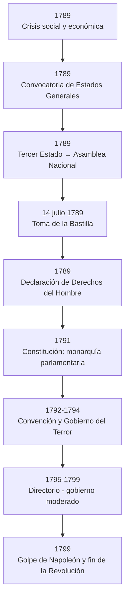

  3️⃣ [Revolución Francesa – Línea temporal](https://www.youtube.com/watch?v=XygZjE5pkqA&list=PLmD-AwX9TN2_VVg6sXjF3_IoWvF_UKzUU&index=5)
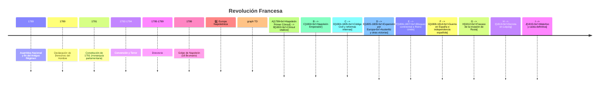
  4️⃣ Europa Napoleónica – Línea temporal
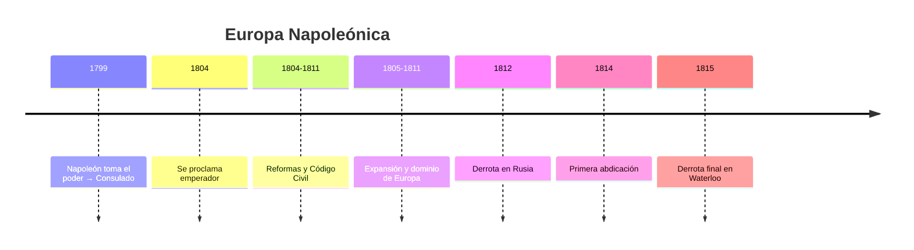

5️⃣ Restauración y Congreso de Viena 
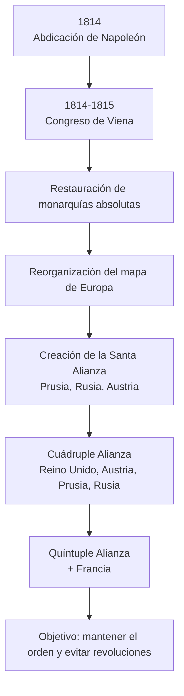

  5️⃣ Restauración y Congreso de Viena – Línea temporal  
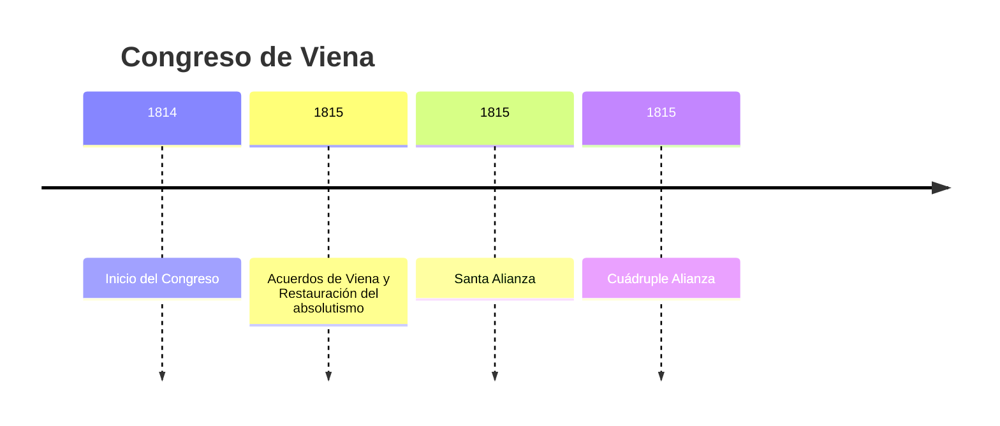

  6️⃣ Revoluciones de 1820-1848
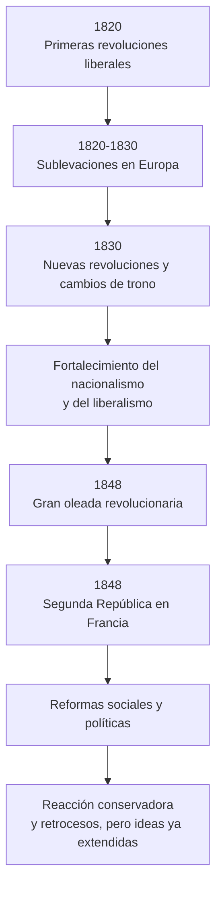

  6️⃣ Revoluciones de 1820-1848 – Línea temporal
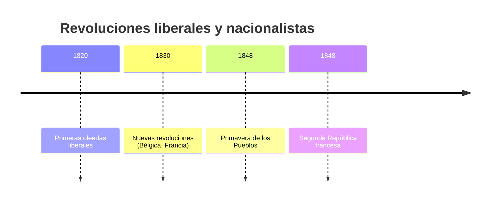

  7️⃣ Nacionalismos y Unificaciones
🇮🇹 Unificación Italiana 
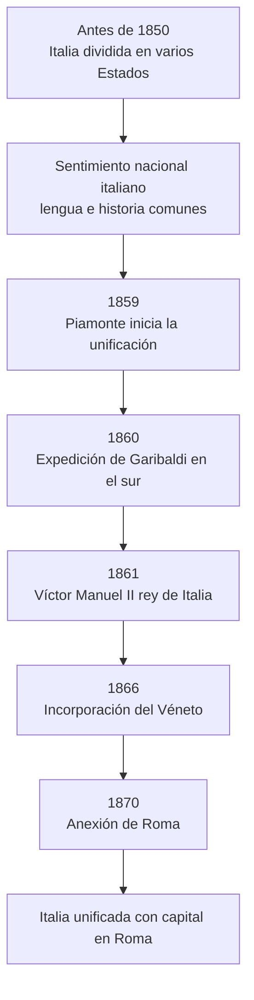

  7️⃣ Unificación Italiana – Línea temporal
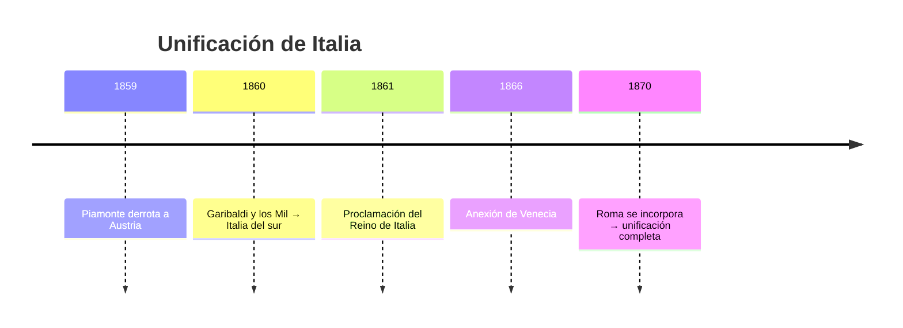

🇩🇪 Unificación Alemana 
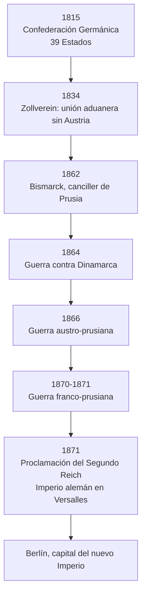
    
  8️⃣ Unificación Alemana – Línea temporal
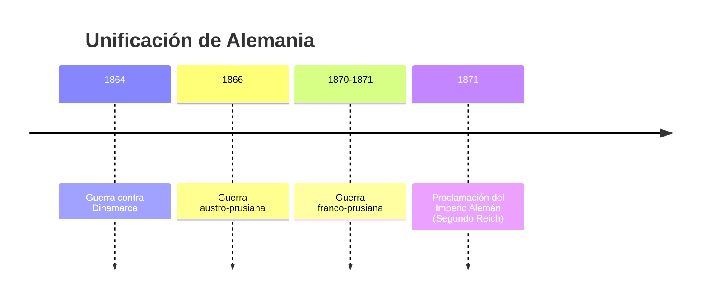