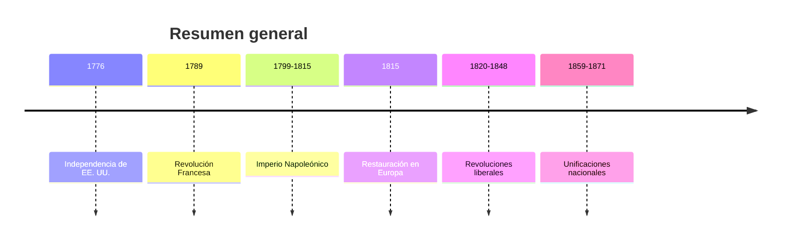
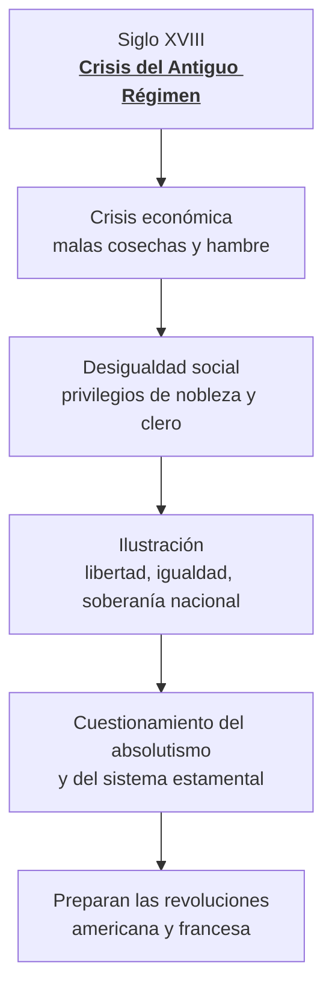

```mermaid
timeline
  title Resumen general
  1776 : Independencia de EE. UU.
  1789 : Revolución Francesa
  1799-1815 : Imperio Napoleónico
  1815 : Restauración en Europa
  1820-1848 : Revoluciones liberales
  1859-1871 : Unificaciones nacionales
```

```mermaid
graph TD
  A[Siglo XVIII<br/><b><u>Crisis del Antiguo Régimen] --> B[Crisis económica<br/>malas cosechas y hambre]
  B --> C[Desigualdad social<br/>privilegios de nobleza y clero]
  C --> D[Ilustración<br/>libertad, igualdad, soberanía nacional]
  D --> E[Cuestionamiento del absolutismo<br/>y del sistema estamental]
  E --> F[Preparan las revoluciones<br/>americana y francesa]

```