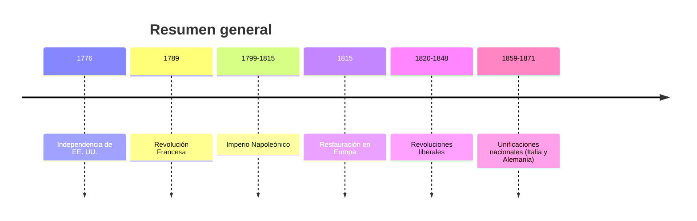
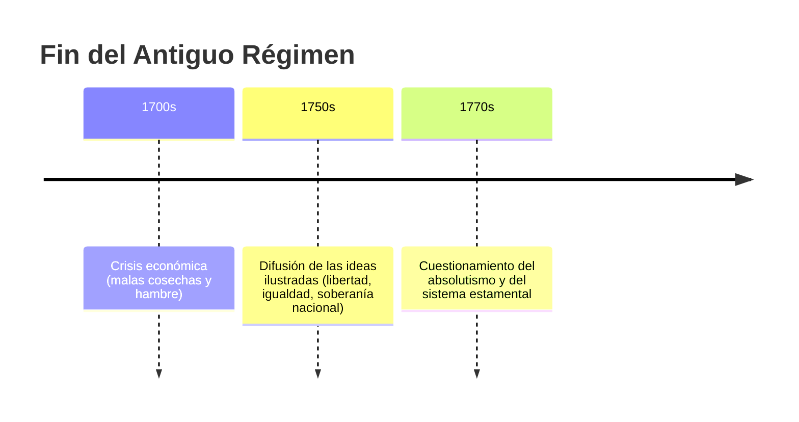
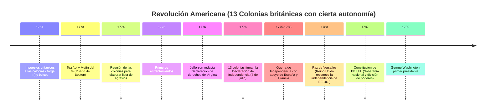
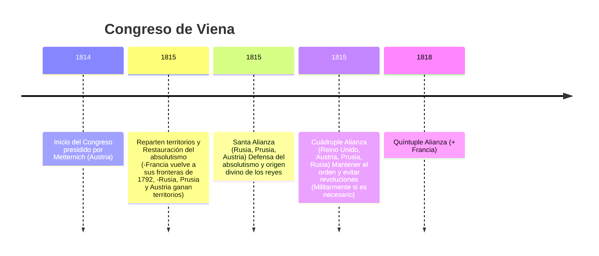
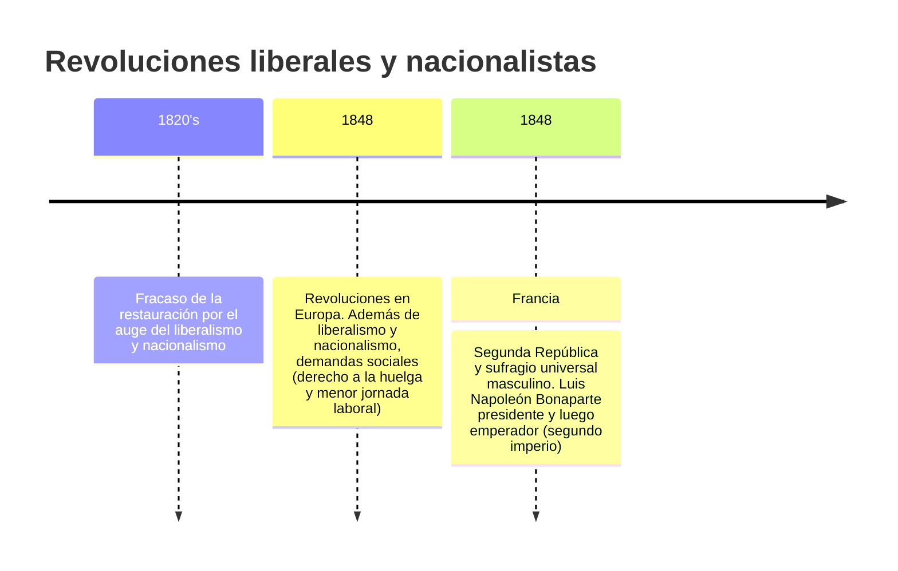
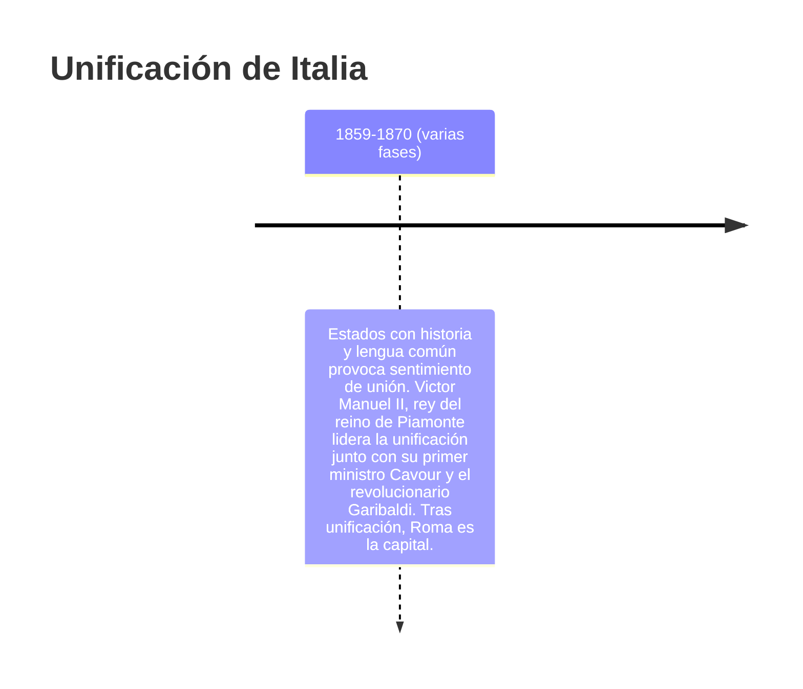
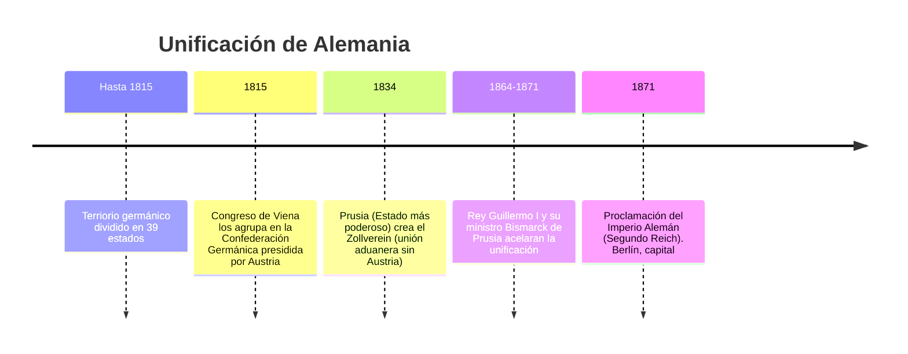

Línea temporal general  


1️⃣ Fin del Antiguo Régimen – Línea temporal



2️⃣ [Revolución Americana](https://www.youtube.com/watch?v=F0C7Cju1NFc&list=PLmD-AwX9TN2_VVg6sXjF3_IoWvF_UKzUU&index=4)


  3️⃣ [Revolución Francesa](https://www.youtube.com/watch?v=XygZjE5pkqA&list=PLmD-AwX9TN2_VVg6sXjF3_IoWvF_UKzUU&index=5)
```mermaid
timeline
  title Revolución Francesa
  1789 : Descontento social y Rey convoca "Asamblea Nacional" para que privilegiados paguen impuestos
  1789: Tercer Estado se proclama Asamblea Nacional y se pasa a reunir en la "Sala del Juego de Pelota" juran conseguir una constitución --> Asamblea Constituyente
  1789 : Asamblea Constituyente aprobó la "Declaración de Derechos del Hombre y del Ciudadano"
  1791 : Se proclama Constitución de 1791 (monarquía parlamentaria con división de poderes)
  1791 : Elecciones se convocan para elegir nueva Asamblea Legislativa
  1792-1794 : Convención(por votación masculina) y Terror (radicalización revolucionaria, ejecución de Luis XVI, Robespierre que era líder jacobino)
  1795-1799 : Directorio (gobierno moderado)
  1799 : Golpe de Napoleón Bonaparte y fin de la Revolución Francesa
 ``` 

  4️⃣ [Europa Napoleónica](https://www.youtube.com/watch?v=UMgNfexkRyg&list=PLmD-AwX9TN2_VVg6sXjF3_IoWvF_UKzUU&index=9)
```mermaid
timeline
  title Europa Napoleónica
  1799 : Napoleón toma el poder y se convierte en Primer Cónsul
  1802 : Se nombra Cónsul vitalicio 
  1804 : Se proclama emperador con política expansionista
  1804-1811 : Código Civil crea Banco de Francia
  1805-1811 : Expansión y dominio de Europa (bloqueo continental a Reino Unido)
  1812 : Derrota en Rusia y España
  1814 : Primera abdicación
  1815 : Derrota final en Waterloo (Luis XVIII rey de Francia)
```

  5️⃣ [Restauración y Congreso de Viena](https://www.youtube.com/watch?v=0evYLq9OXx4&list=PLmD-AwX9TN2_VVg6sXjF3_IoWvF_UKzUU&index=6)

  6️⃣ Revoluciones de 1820-1848


  7️⃣ Nacionalismos y Unificaciones
  ```mermaid
graph TD
  A[Nacionalismo coge fuerza tras el congreso de Viena] --> B[Culturas sometidas a Estados o imperios de los que no se sentían parte]
  B --> C[2 tipos de nacionalismo:<br/>-<b>Disgregadores</b>: buscan independencia. Ej. Bélgica se separó de Países Bajos<br/>-<b>Agregadores</b>: buscan unificación. Ej. Italia y Alemania]
```


  7️⃣ Unificación Italiana (1859-1870) – Línea temporal


    
  8️⃣ Unificación Alemana – Línea temporal
